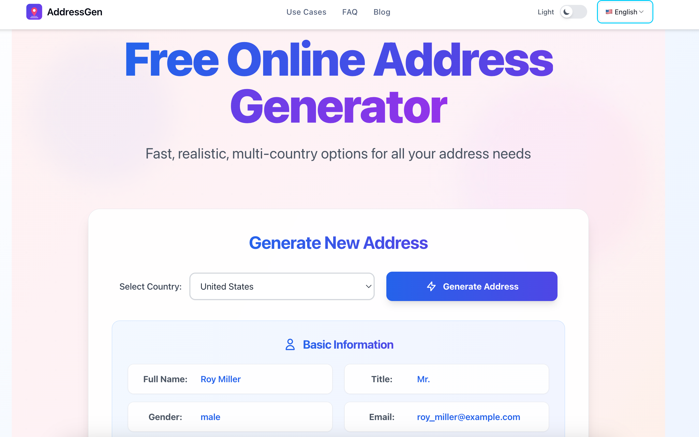
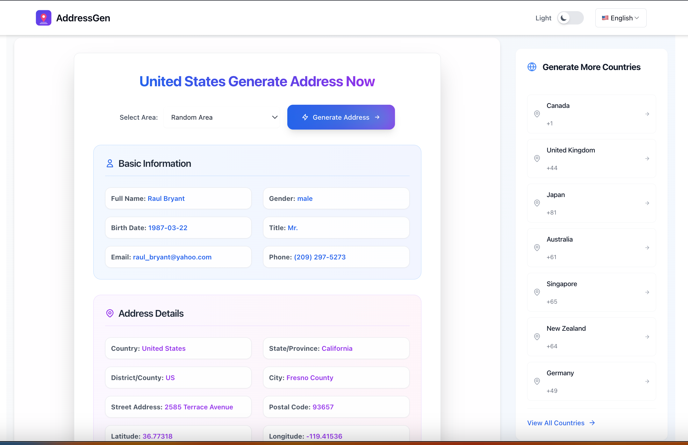

# 地址生成器 (Address Generator)

> **多语言版本**: [English](README.en.md) | [日本語](README.ja.md) | [Русский](README.ru.md) | 中文

一个功能强大的地址生成工具，支持多种类型的地址生成，包括虚拟地址、测试地址等。

## 📸 项目截图



## 🌟 在线体验

访问 [https://addressgen.top](https://addressgen.top) 获得最佳体验！

## ✨ 功能特性

- 🏠 **真实地址生成** - 生成符合格式的各国地址
- 🌍 **多国家支持** - 支持美国、加拿大、英国、澳大利亚、德国、法国
- 📱 **响应式设计** - 完美适配桌面和移动设备
- 🎯 **批量生成** - 一次生成多个地址
- 📋 **一键复制** - 快速复制生成的地址
- 🔄 **实时生成** - 无需刷新页面
- 🎨 **现代UI** - 简洁美观的用户界面

## 🚀 快速开始

### 在线使用
直接访问 [https://addressgen.top](https://addressgen.top) 即可使用所有功能。

### 本地运行

```bash
# 克隆项目
git clone https://github.com/FunQz-com/address-generator.git
cd address-generator

# 安装依赖
npm install

# 启动开发服务器
npm run dev

# 构建生产版本
npm run build
```

## 📖 使用说明

1. 选择需要生成的国家/地区
2. 设置生成数量
3. 点击"生成地址"按钮
4. 复制或导出生成的地址

## 🛠️ 技术栈

- **前端**: HTML5, CSS3, JavaScript (ES6+)
- **样式**: CSS Grid, Flexbox
- **构建**: Vite
- **部署**: 支持静态部署

## 📝 支持的地址格式

- 🇺🇸 美国地址 (包含州、邮编、街道)
- 🇨🇦 加拿大地址 (包含省份、邮政编码)
- 🇬🇧 英国地址 (包含郡县、邮编)
- 🇦🇺 澳大利亚地址 (包含州、邮编)
- 🇩🇪 德国地址 (包含联邦州、邮编)
- 🇫🇷 法国地址 (包含大区、邮编)

### 🇺🇸 美国地址生成示例



*美国地址生成器展示了完整的美国地址格式，包括街道、城市、州和邮政编码*

## 🤝 贡献指南

欢迎提交 Issue 和 Pull Request！

1. Fork 本项目
2. 创建特性分支 (`git checkout -b feature/AmazingFeature`)
3. 提交更改 (`git commit -m 'Add some AmazingFeature'`)
4. 推送到分支 (`git push origin feature/AmazingFeature`)
5. 开启 Pull Request

## 📄 许可证

本项目采用 MIT 许可证 - 查看 [LICENSE](LICENSE) 文件了解详情。

## 🔗 相关链接

- 🌐 **官方网站**: [https://addressgen.top](https://addressgen.top)
- 📧 **反馈建议**: 通过 Issues 提交
- ⭐ **如果这个项目对你有帮助，请给个 Star！**

---

💡 **提示**: 生成的地址仅用于测试和开发目的，请勿用于非法用途。
